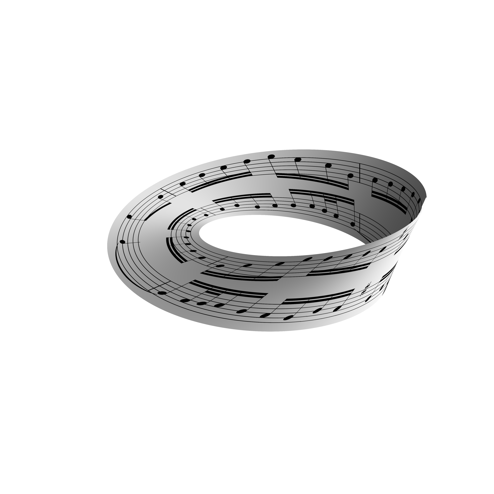

# IMG_to_Mobius_Loop

A simple Python script that wraps a `.jpg` image around a 3D Möbius strip using matplotlib.

Example input and output:

**Input:**


**Output:**


---

## Usage

### Requirements

Install required packages:

```bash
pip install numpy pillow matplotlib
```

### Run

```bash
python main.py example/BWV1087.jpg --save
```
---

## Arguments

| Argument          | Description                                             | Default  |
| ----------------- | ------------------------------------------------------- | -------- |
| `image`           | Path to the `.jpg` image file                           | Required |
| `--band_size_adj` | Adjusts the band width (relative to image aspect ratio) | `0`      |
| `--elev`          | Elevation angle of the 3D view                          | `25`     |
| `--azim`          | Azimuth angle of the 3D view                            | `-45`    |
| `--perspective`   | Perspective scaling factor                              | `0.8`    |
| `--zoom`          | Camera zoom level                                       | `2.2`    |
| `--image_shift`   | Horizontal image shift (loop offset)                    | `0`      |
| `--res_factor`    | Downsampling factor for faster rendering                | `1`      |
| `--transparent`   | Enable brightness-based alpha transparency              | Off      |
| `--save`          | Save the output image as `mobius_strip_render.png`      | Off      |

